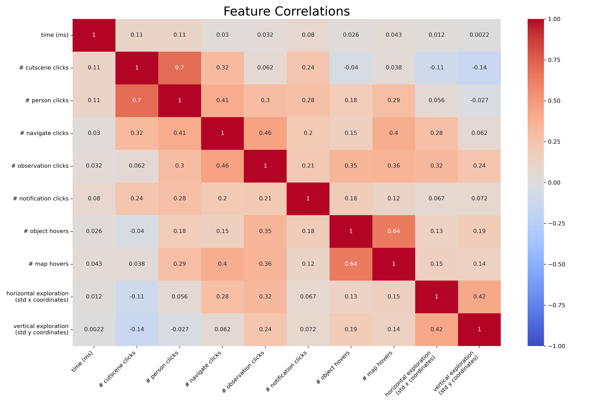
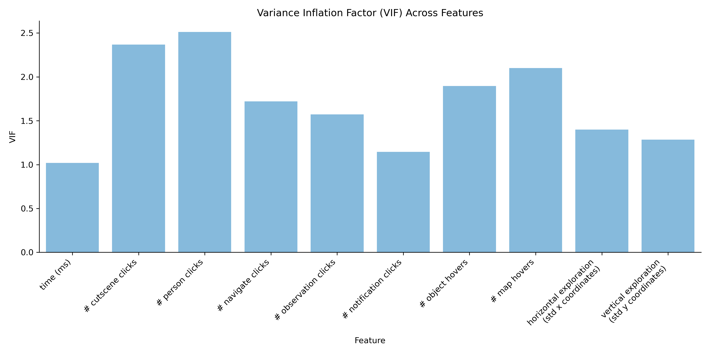
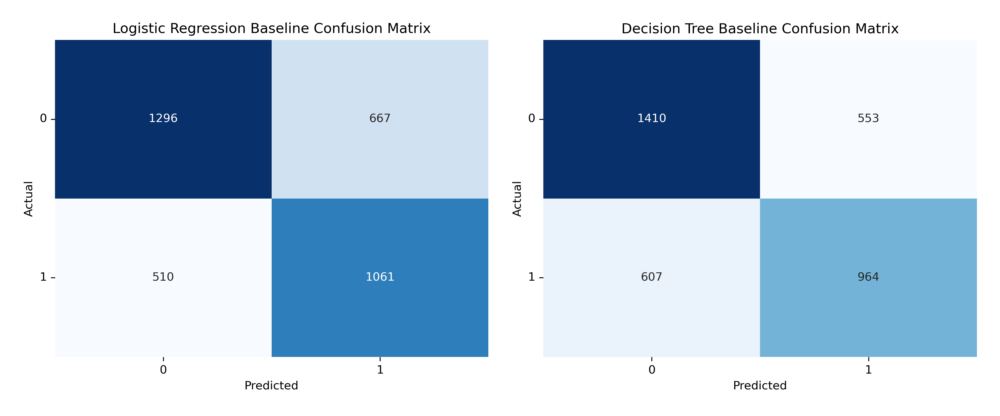
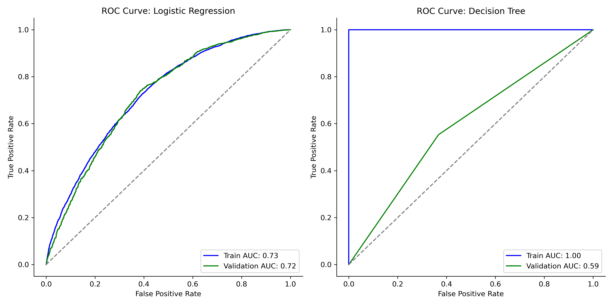
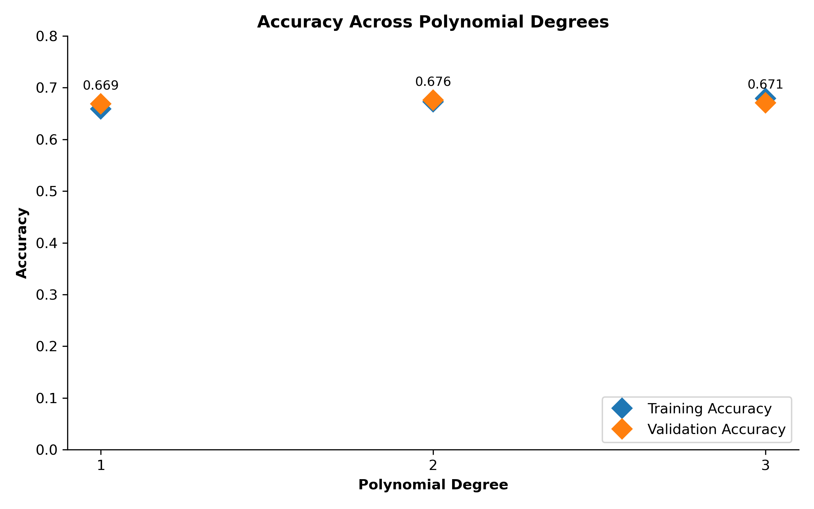
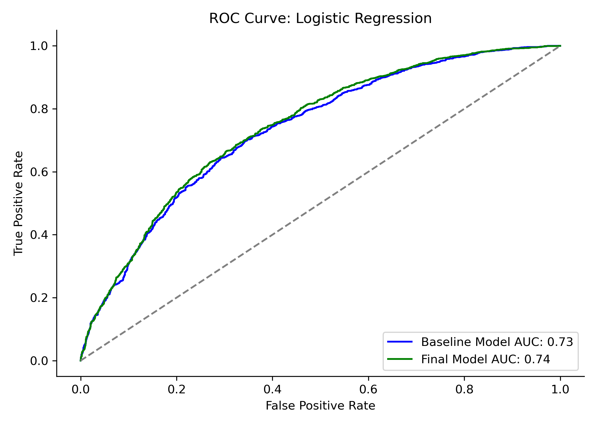
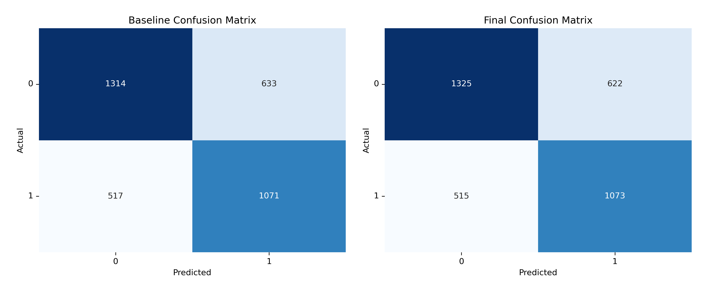

# Predicting Student Performance From Gameplay

BrainBoost Interactive is a growing company with a mission to create educational games that dynamically update based on predicted student performance. Their mission requires that they develop the ability to predict test performance based on student’s interactions with their games. Here, I develop a classification model that BrainBoost Interactive can use to determine whether students will pass an evaluation interspersed throughout the choose-your-own adventure detective game: Jo Wilder and the Capitol Case.


## Dataset & Methods
The training and validation data for this model were sourced from game plays hosted on the [PBS Wisconsin Education website](https://pbswisconsineducation.org/jowilder/play-the-game/). The data has been aggregated and is [available on Kaggle](https://www.kaggle.com/competitions/predict-student-performance-from-game-play/overview).

Examination of the dataset reveals that it is structured as a time series. Each participant has multiple rows corresponding to data from 1 out of the 22 levels. To make the data more interpretable, I aggregated over the 22 levels to derive a single value for each feature per level.

## Preparation for Modeling
Prior to modeling, it is essential to assess the presence of collinearity (where two features are highly correlated) and multicollinearity (where one feature can be linearly predicted from others). To do this, I examined pairwise correlations among the features and calculated the variance inflation factor (VIF) for each one.



The correlation heatmap reveals that most of the features are not significantly correlated with each other, underscoring the independence of each feature. Most correlation values are below 0.4, and all are below the standard threshold of 0.7, indicating that no correlation value is excessively high.

To further validate the absence of multicollinearity, I next calculated the Variance Inflation Factor (VIF) for each feature.



All VIF values are well below the standard threshold of 5, with the highest being cutscene_clicks at approximately 2.13. These low VIF values reinforce confidence in the independence of the features. Because of this, I fed all 10 features into the baseline models. 

## Baseline Model Comparison
I fit two baseline models for this binary classification problem: logistic regression and decision tree. Model performance will be gauged using accuracy, as it is crucial to accurately identify students whether they pass or fail the test. This will help the game adjust dynamically both for students who are doing well and need more of a challenge and for students who are not doing well and need assistance. As a secondary test, I also looked at F1 scores for the baseline models.




The logistic regression outperforms random chance (with an accuracy above 0.50) and exhibits consistent performance across both the training and validation datasets. This is encouraging as it suggests the model is not overfitting. However, it might be underfitting, indicating a potential need for model tuning.

The decision tree appears less promising. It shows signs of overfitting, demonstrated by perfect accuracy and F1 scores on the training dataset, while its scores are close to chance on the validation dataset.

The AUC curves provides further confidence in the logistic regression model. An AUC of 0.72 suggests that there is a 72% chance that the logistic regression model will correctly differentiate between passing and failing students. The fact that the training and validation curves nearly overlap suggests a balanced model that is not overfitting or underfitting significantly. The perfect AUC of 1.00 on the training data contrasted with a subpar AUC of 0.58 on the validation data emphasizes its overfitting nature and poor generalization to new, unseen data.

Moving forward, I prioritized the logistic regression model and worked to determine which solver, which regularization strength, and tolerance level led to the best performance. However, despite hyperparameter tuning, there was only a slight improvement from the baseline model (accuracy = 0.659). For this reason, I revisited the initial set of features used in the model, by exploring whether incorporating polynomial versions of these features (and their interactions) would enhance the model's accuracy. I iterated through logistic regression models trained on 1-degree, 2-degree, and 3-degree polynomial features.



The model utilizing 2-degree polynomial features shows marginally better performance on the validation dataset compared to the others, so it will be used for the final model configuration. Next, I will evaluate the final model (logistic regression with C=0.04 and 2-degree polynomials) on the testing dataset. To visualize its efficacy, I utilized both an ROC curve and a confusion matrix.




## Conclusions and Next Steps
The objective of this project was to aid BrainBoost Interactive in predicting student performance based on their interactions with the game "Jo Wilder and the Capitol Case." We successfully constructed a logistic regression model that outperforms random chance, demonstrating the potential to utilize gameplay data for educational insights. While the model's performance is a promising start, its current accuracy might not be sufficient for real-world applications that BrainBoost Interactive envisions.

To truly harness the predictive power necessary for dynamically updating educational games, a few potential avenues could be explored:

* Time-Series Data and Modeling: The gameplay naturally has a temporal component, with students interacting with the game over time. By leveraging time series data and employing relevant modeling techniques, we might capture patterns and nuances missed by aggregate models like logistic regression.

* Incorporating Demographics: Introducing demographic variables such as age and reading level could provide more depth to the analysis. There's potential for interactions between these demographic features and gameplay metrics (like time spent on each level or number of clicks) which could offer richer insights and improve model performance.

While we have made significant strides in predicting student performance through gameplay interactions, there's room for improvement. With further refinements and the inclusion of more diverse data sources, we aspire to create a tool that's not only predictive but also instrumental in enhancing the educational experience for students using BrainBoost Interactive games.

 
## Repository Structure
```none            
├── data 
├── figs                   
├── .gitignore
├── README.md 
├── gameplay-classification.ipynb
└── brainboost-gameplay-classification.pdf

